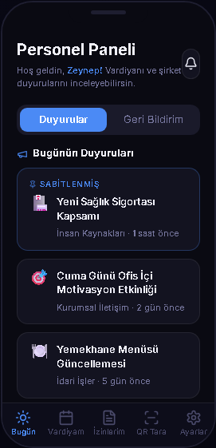
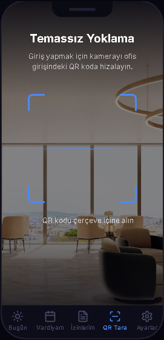
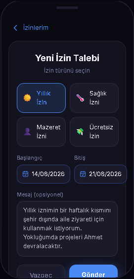
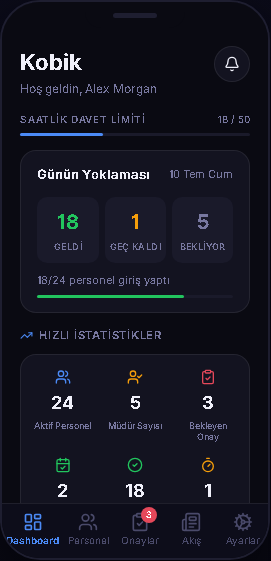
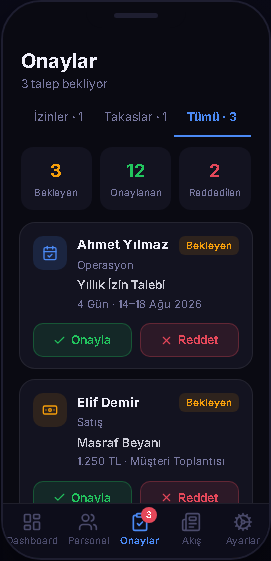
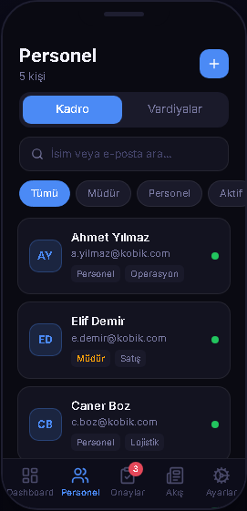
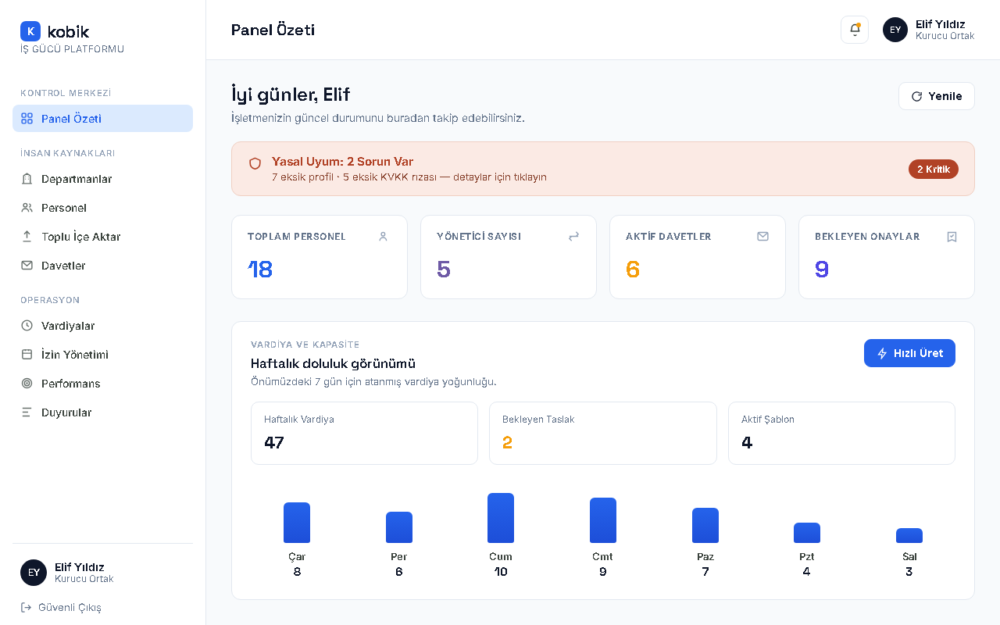
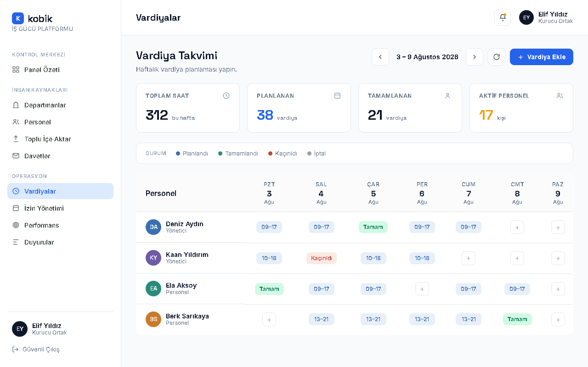
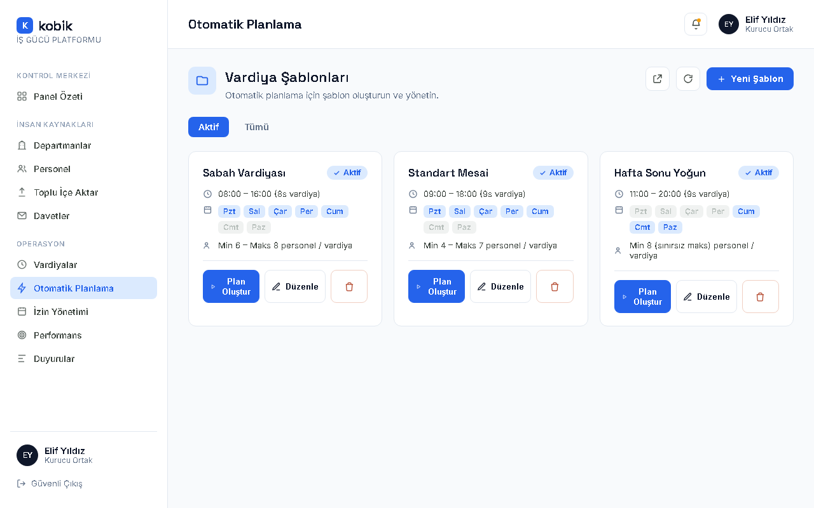

<div align="center">

<h1>SME HR Management System</h1>
<p><em>A full-stack Human Resources platform built for Small & Medium Enterprises</em></p>

[](https://kobik.dev)
[](https://fastapi.tiangolo.com)
[](https://reactnative.dev)
[](https://react.dev)
[](https://postgresql.org)
[](https://redis.io)
[](https://docker.com)
[](https://typescriptlang.org)

</div>

# Kobik HR — SME HR Management System

**Portfolio & live showcase:** [kobik.dev](https://kobik.dev)

A full-stack Human Resources platform for **Small & Medium Enterprises (SMEs)**. One monorepo, three client applications, and a shared REST API—plus an OR-Tools scheduling worker for automated shift planning.

## Overview

Managing people in a growing business should not require expensive enterprise software. Kobik HR gives owners, managers, and employees a unified toolkit on **mobile and web**, covering onboarding, scheduling, attendance, leave, feedback, and internal communications.

## Screenshots

*Design previews* (Figma-derived mobile mockups and marketing web panel demos). The production apps may differ slightly in layout and copy.

### Mobile (design previews)

| Employee home | QR attendance | Leave request |
|:---:|:---:|:---:|
|  |  |  |

| Manager dashboard | Approvals | Roster |
|:---:|:---:|:---:|
|  |  |  |

### Web admin (design previews)

| Panel overview | Shifts | Auto-scheduling |
|:---:|:---:|:---:|
|  |  |  |

More context and live marketing demos: **[kobik.dev](https://kobik.dev)**

## At a glance

| | |
|---|---|
| **API surface** | 120+ REST endpoints (auth, shifts, leave, QR attendance, scheduler, reports, …) |
| **Clients** | React Native (Expo) mobile app · React web admin dashboard |
| **Backend** | FastAPI · PostgreSQL · Redis · MinIO |
| **Scheduling** | Dedicated OR-Tools worker service |
| **Delivery** | Docker Compose · GitHub Actions CI/CD · EAS mobile builds |

This README describes a **production-grade system** maintained in a private repository; this public repo is the portfolio showcase (architecture, design previews, and product narrative).

## Try it

- **Today:** Request a walkthrough or demo via **[kobik.dev](https://kobik.dev)**.
- **Planned:** One-click **guest demo** (read-only tenant with seeded data, daily reset, rate limits)—not available yet; no implementation in this repository.

## Builder's note

I built Kobik HR because growing SMEs often juggle spreadsheets, chat threads, and generic tools that were never meant for workforce operations. I wanted one coherent stack—mobile-first for employees, a focused web panel for owners—without importing full enterprise HR suites.

What challenged me most:

- **Splitting concerns cleanly** — API, mobile, dashboard, and an OR-Tools scheduler as separate deployable units while sharing one domain model.
- **QR attendance** — Short-lived, rotating session tokens in Redis so check-in stays simple for staff but hard to replay.
- **RBAC in the mobile app** — Parallel navigation patterns for owners/managers vs employees (Feature-Slice Design), without duplicating business logic on the client.

If you're reviewing this for hiring: the private codebase is where day-to-day delivery happens; this repo is the story, design previews, and architecture summary. Feedback welcome via [Issues](https://github.com/opanda01/sme-hr-management-showcase/issues/new/choose) (see [CONTRIBUTING.md](CONTRIBUTING.md)).

## Architecture

```
monorepo/
├── apps/
│   ├── api/          # FastAPI backend (Python)
│   ├── mobile/       # React Native / Expo app (Kobik HR)
│   ├── dashboard/    # React web admin panel
│   └── scheduler/    # OR-Tools shift planning engine
└── docs/             # Architecture & setup (private dev repo)
```

| Layer | Technology |
|-------|------------|
| **Backend API** | FastAPI · SQLAlchemy 2 · PostgreSQL · Redis |
| **Mobile** | React Native · Expo · Zustand · NativeWind |
| **Web dashboard** | React 19 · Vite 7 · Tailwind CSS 4 · Zustand |
| **Infrastructure** | Docker Compose · MinIO · GitHub Actions CI/CD · EAS |

## Core features

### Authentication & access control

- Role-based access: Owner / Manager / Employee
- Company registration with superadmin approval
- Dynamic invite codes for employee onboarding
- JWT auth with email and SMS OTP verification
- Password reset: email → OTP → new password

### Shift management

- Create, bulk-create, update, and cancel shifts
- Employee self-service schedule
- Shift swap: employee → peer response → manager approval

### Leave management

- Types: Annual / Sick / Personal / Unpaid
- Request → approve/reject with manager notifications
- Per-employee leave balance
- Turkish public holiday support

### QR attendance

- Manager starts a QR session (rotating token in Redis)
- Employee scan via camera; check-in with cooldown
- Live attendance summary for managers

### Announcements & feedback

- Pinnable announcements, unread badges, read receipts
- Anonymous or identified feedback; manager reply and archive

### Extended capabilities

- **Departments** and org structure
- **Auto-scheduling** via OR-Tools (dedicated scheduler service)
- **Notifications** (email/SMS/push) and realtime updates
- **Documents & exports** (MinIO storage, CSV/PDF reporting)
- **Legal & consent** flows for registration compliance

### Mobile application

- Feature-Slice Design (FSD)
- Dual tab layouts for Owner/Manager vs Employee (RBAC)
- Manager hub: management vs personal view
- Theming (multiple themes, persisted state)
- Forms: react-hook-form + zod; strict email validation client & server

### Web dashboard

- Company statistics and date-range attendance reports
- Employee CRUD, bulk import, role assignment
- Invitation management and workforce tooling

## API

The backend exposes **120+ REST endpoints** across domains including:

`auth` · `users` · `admin` · `companies` · `departments` · `employees` · `shifts` · `leaves` · `shift-swaps` · `qr` · `attendance` · `feedback` · `announcements` · `scheduler` · `dashboard` · `reports` · `notifications` · `files` · `legal`

Interactive OpenAPI docs: `/docs` when the API runs locally (private development repository).

## Code examples

Sanitized excerpts from the production monorepo (not runnable as-is): **[examples/](examples/)**

- **API** — shift swap router (RBAC, Pydantic, multi-step approval)
- **Mobile** — Expo QR attendance scanner (camera, token parsing, UI state)
- **Scheduler** — OR-Tools CP-SAT shift assignment core

See [examples/README.md](examples/README.md) for context and production source paths.

## Quality & delivery

- GitHub Actions: lint, type-check, API unit/integration tests, Docker image builds
- Staging and production deploy workflows; mobile builds via EAS
- Jest + React Testing Library on mobile
- Docker Compose for local PostgreSQL, Redis, and MinIO
- `.env.example` pattern—no secrets in version control

## Showcase roadmap

Planned improvements documented here (not necessarily implemented in this repo yet):

| Item | Status |
|------|--------|
| Embedded screenshots & design previews | Done (see above) |
| `examples/` — sanitized code excerpts from the private monorepo | Done — [examples/](examples/) |
| Guest demo tenant (one-click, seeded data) | Planned (see **Try it**) |
| Short GIF walkthrough (e.g. QR or shift-swap) | Optional / later |

## Status

This repository is a **public showcase** for portfolio and product marketing. **Production source and ongoing development** are maintained in a **private repository**.

**Contributions:** pull requests are not accepted. Open a **Portfolio feedback** issue or see [CONTRIBUTING.md](CONTRIBUTING.md).

## License & contact

This showcase repository is provided for portfolio and demonstration purposes only. See [LICENSE](LICENSE.md) in this repository. Product inquiries: [kobik.dev](https://kobik.dev).

---

Built by [kobik.dev](https://kobik.dev)

<div align="center">
<sub>FastAPI · React Native · React · PostgreSQL · Redis · MinIO · OR-Tools · Docker · Firebase</sub>
</div>
